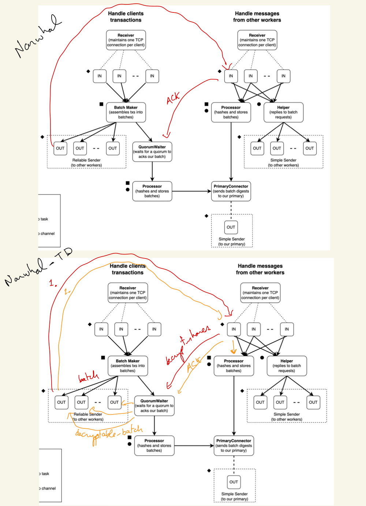
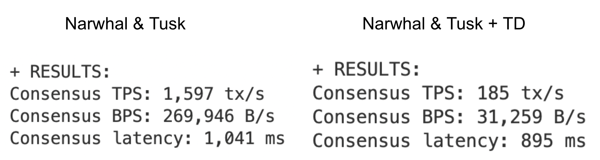

# Threshold Decrypted Narwhal and Tusk

This repo provides a threshold-decryption augmented narwhal&tusk consensus protocol, which we presented as our submission to the Encode x Wintermute [MEV Hackathon](https://www.encode.club/wintermute-mev-hack).

Our presentation slides can be found [here](https://docs.google.com/presentation/d/12xWSvocGeIrRiJ4otSP2OWvFDNshd1x8buArux0BzG8/edit?usp=sharing).
Our brainstorming and project ideation notes can be found [here](https://docs.google.com/document/d/1gML_jmFCRXr_JSzivE7RacdDGlMsGXC-bo4niCFJP_4/edit?usp=sharing).

## General idea
We took our main inspiration from Dahlia Malkhi's recent [BEV resistance on DAG-based BFT](https://dahliamalkhi.github.io/posts/2022/07/dag-fo/) blog post. She presented a theoretical threshold decryption protocol that piggybacks on Narwhal's (actually, Finn, which is her simplified version of Narwhal & Bullshark) DAG structure, but left implementation as an exercise. We implemented a part of that idea on top of Narwhal & Tusk.

As outlined in our presentation, we perform threshold decryption at the Worker level. This has the advantage of not slowing down the DAG creation (which only requires batch digests) and consensus on top, with results (see [benchmarking](#benchmarking)) showing only a 10x slowdown, which is much less than other threshold decryption protocols implemented at the consensus layer. However, it has the disadvantage of relying on a DAG-history linearization algorithm (see this [blog post](https://decentralizedthoughts.github.io/2022-06-28-DAG-meets-BFT/#the-bullshark-protocol) for more details) that doesn't permit adversarially reordering transactions once the threshold shares are known. One easy example is not permitting reordering of transactions inside worker batches. We leave the analysis of such consensus rules as future research. Note that this is also never discussed in Narwhal related works. For eg., the implementation [delivers entire blocks](https://github.com/asonnino/narwhal/blob/9061f4113d7099696e607c3da3d3b5427b1fc33a/node/src/main.rs#L138) to the state machine, not individual transactions.

## Transaction Lifecycle
First, a threshold key set (n=3f+1 private key shares, 2f+1 of which are needed to decrypt a tx) are shared between the n validators (assumed fixed). The matching public key is shared with all clients. A transaction is then processed by the network as follows:
1. the client encrypts his tx using the public key and sends it to a [worker](https://github.com/samlaf/narwhal-td/tree/master/worker) of some validator
2. the validator broadcasts this tx (inside a batch of txs) to all other validators
3. it waits for 2f+1 decryption shares from other validators (2f+1 decryption shares for each tx in the batch it sent)
4. It forms a DecryptableBatch structure (batch + all decryption shares), broadcasts it back to all other validators, and
5. finally sends the hash digest of this DecryptableBatch to the DAG construction algorithm in the [primary](https://github.com/samlaf/narwhal-td/tree/master/primary)

## Architecture changes
We only modify the [worker architecture](https://github.com/asonnino/narwhal/tree/master/worker), as follows:


That is, the `BatchMaker` and `QuorumWaiter` now process both Batches and DecryptableBatches (batches containing 2f+1 decryption shares for each transactions). There are thus now 2 rounds of reliable broadcast between workers:
1. batches are reliably broadcast as before, but instead of only waiting for 2f+1 ACK, they wait for 2f+1 decryption shares from other workers
2. Once these decryption shares are gathered, the worker forms a DecryptableBatch and broadcasts it back to all other workers, this time waiting for a 2f+1 quorum.

## Benchmarking


To perform this benchmark, follow the same steps as outlined in the [Narhwal repo](https://github.com/asonnino/narwhal#quick-start):
```
$ cd narwhal/benchmark
$ pip install -r requirements.txt
$ fab local
```
These same instructions also need to be ran in the [encrypt-client](https://github.com/samlaf/narwhal/tree/encrypt-client) branch to obtain the results for the non threshold-decrypted Narwhal&Tusk.

Note that the tps presented are just as a means of relative comparison, and are nowhere near the optimal throughputs for Narwhal, presented in the original repo and paper.

## Current limitations
We currently assume that the threshold keys are integer weighted. This limits the use to equal-weighted validators, and thus cannot be used inside a PoS system. It is straightforward however to extend our approach to use a weighted scheme. See [ferveo's codebase](https://github.com/anoma/ferveo/blob/main/book/src/dkginit.md) for an example.